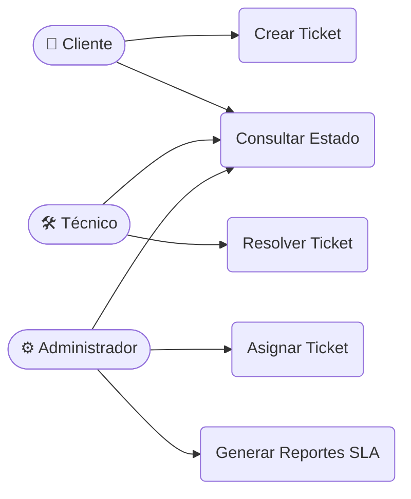
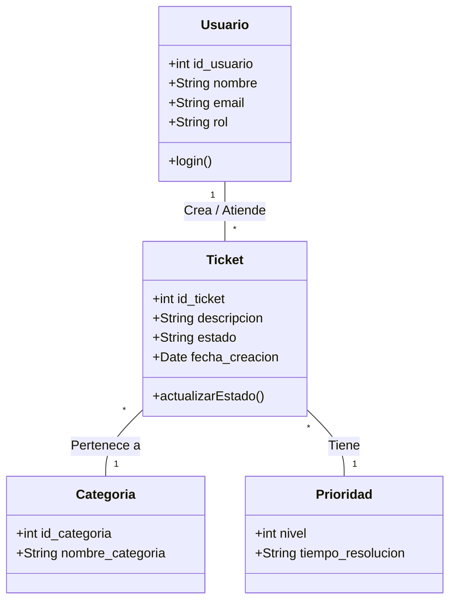

# Modelado UML del Sistema Help Desk

```mermaid
flowchart LR
    %% Actores
    Cliente([👤 Cliente])
    Tecnico([🛠️ Técnico])
    Admin([⚙️ Administrador])

    %% Casos de Uso
    Crear(Crear Ticket)
    Ver(Consultar Estado)
    Resolver(Resolver Ticket)
    Asignar(Asignar Ticket)
    Reportes(Generar Reportes SLA)

    %% Relaciones
    Cliente --> Crear
    Cliente --> Ver
    Tecnico --> Ver
    Tecnico --> Resolver
    Admin --> Asignar
    Admin --> Reportes
    Admin --> Ver
```

## Diagrama de Clases

```mermaid
classDiagram
    class Usuario {
        +int id_usuario
        +String nombre
        +String email
        +String rol
        +login()
    }

    class Ticket {
        +int id_ticket
        +String descripcion
        +String estado
        +Date fecha_creacion
        +actualizarEstado()
    }

    class Categoria {
        +int id_categoria
        +String nombre_categoria
    }

    class Prioridad {
        +int nivel
        +String tiempo_resolucion
    }

    Usuario "1" -- "*" Ticket : Crea / Atiende
    Ticket "*" -- "1" Categoria : Pertenece a
    Ticket "*" -- "1" Prioridad : Tiene
```
